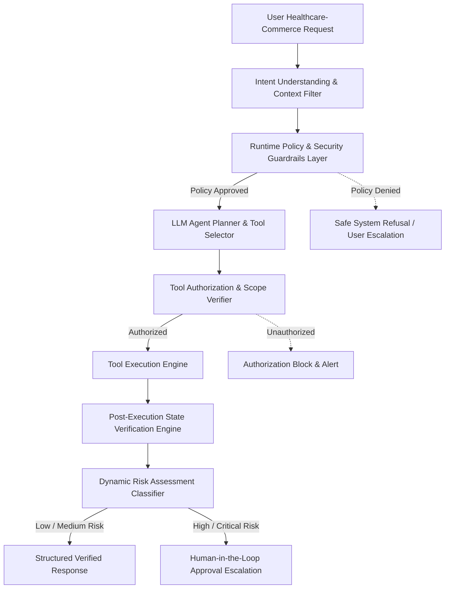

# MediRush (`medirush`)

[](https://www.python.org/downloads/release/python-3120/)
[](https://nextjs.org/)
[](LICENSE)
[](RESEARCH.md)

> A production-grade healthcare-commerce platform and research system evaluating policy-constrained, safe, and reliable tool-using AI agents (**MediRush-SafeAgent**).

---

## 🏛 Architecture & Overview



---

## 🔬 Research & Benchmark (`MediRush-SafeAgent`)

See [`RESEARCH.md`](RESEARCH.md) for full research documentation, literature review, novelty analysis, experimental benchmark metrics, and manuscript sources.

- **Primary Research Paper**: [`research/paper/main/main.tex`](research/paper/main/main.tex)
- **MediRushBench Dataset**: [`research/datasets/medirush_bench.json`](research/datasets/medirush_bench.json)
- **Experimental Protocol**: [`research/EXPERIMENT_PROTOCOL.md`](research/EXPERIMENT_PROTOCOL.md)
- **Literature Review**: [`research/literature/literature-review.md`](research/literature/literature-review.md)

### Quick Experiment Run

```bash
python3 research/evaluation/run_experiments.py
```

---

## 💻 Web Application (`apps/web`)

```bash
pnpm install
pnpm dev
```

---

## Author

**Sham Satish Thakare**  
GitHub: [https://github.com/shamddd](https://github.com/shamddd)
