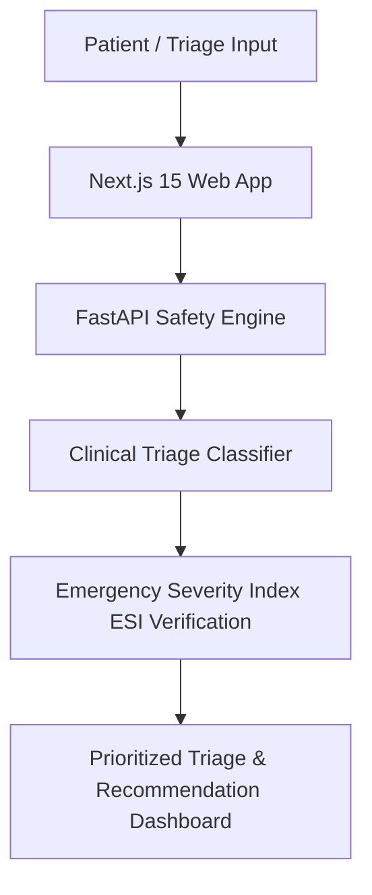

# MediRush Architecture & System Design

## 1. System Overview
`medirush` is a clinical emergency triage assistant built with Next.js 15, FastAPI, and safety-constrained triage logic.

## 2. Safety & Verification
- **ESI Protocol Verification:** Deterministic clinical rule fallback verifying Emergency Severity Index categorization before AI output rendering.
- **Monorepo Architecture:** PNPM workspace isolating `@medirush/web` frontend and `@medirush/core` shared utilities.
